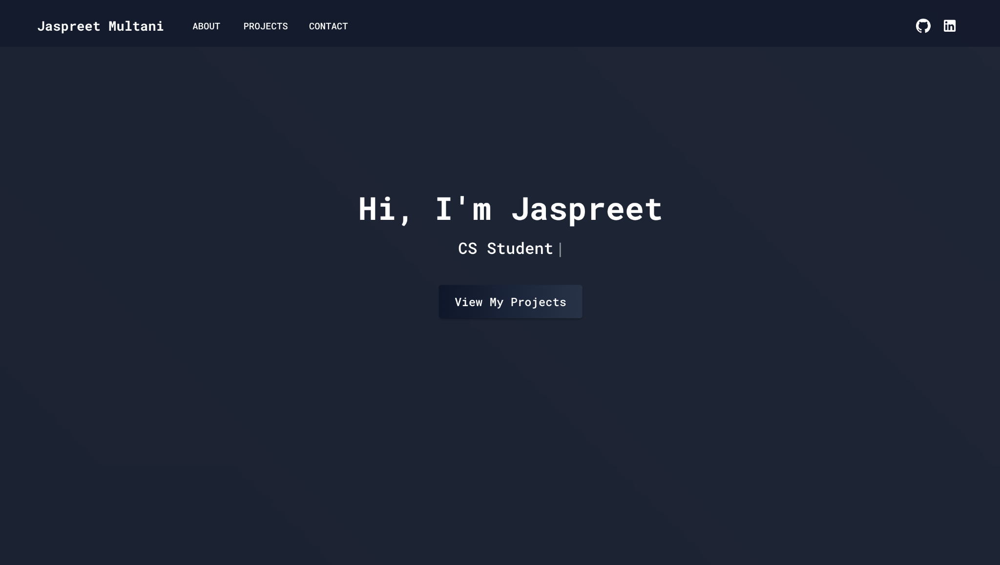
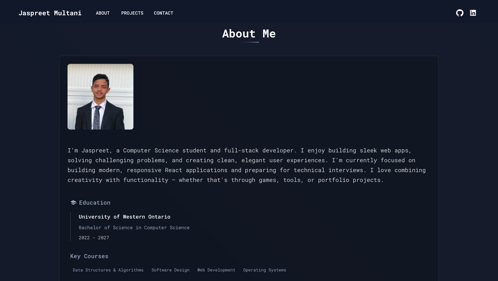
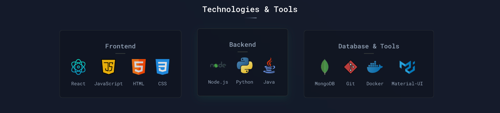
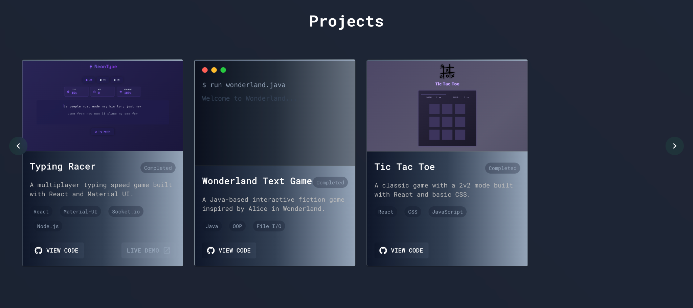
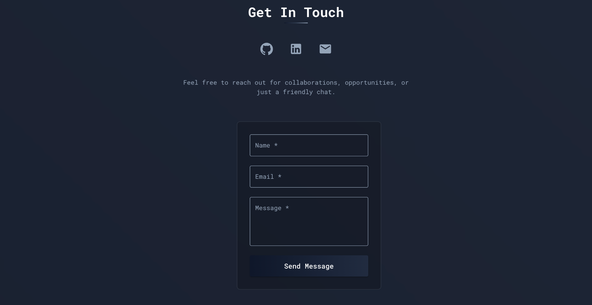

# Jaspreet Multani — Portfolio Website

Welcome to my personal portfolio site! 🚀  
Built with **React** and **Material UI**, this site showcases my work, skills, and background as a Computer Science student and aspiring Software Engineer.

🌐 **Live Site**: [www.jaspreetmultani.com](https://www.jaspreetmultani.com)

---

## ✨ Features

- Clean, modern UI built with React and Material UI
- Animated typewriter introduction
- Projects showcase with tech stack tags
- Fully functional contact form via EmailJS
- Custom domain: `jaspreetmultani.com`
- Mobile responsive and fast-loading

---

## 🛠 Tech Stack

- **Frontend**: React, JavaScript
- **Styling**: Material UI
- **Email Service**: EmailJS
- **Deployment**: GitHub Pages + Custom Domain (DNS)

---

## 📸 Screenshots

### 🔹 Hero Section


### 🔹 About Me


### 🔹 Tech Stack


### 🔹 Projects Showcase


### 🔹 Contact Section


---

## 🚀 Getting Started

To run this project locally:

```bash
git clone https://github.com/JaspreetMultani/Jaspreet-Multani-portfolio.git
cd Jaspreet-Multani-portfolio
npm install
npm run dev
```
